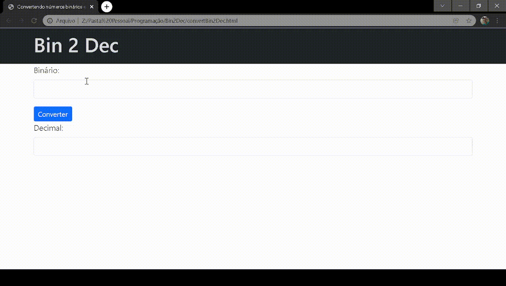

# Bin2Dec

O Bin2Dec permite que o usuário insira cadeias de até 8 dígitos binários, 0 e 1, em qualquer sequência e, em seguida, exiba seu equivalente decimal.

***

### Links úteis

* [App-Ideas](https://github.com/florinpop17/app-ideas)
* [CFB Cursos](https://www.youtube.com/cfbcursos)
* [Mozilla](https://developer.mozilla.org/pt-BR)
* [W3Schools](https://www.w3schools.com)